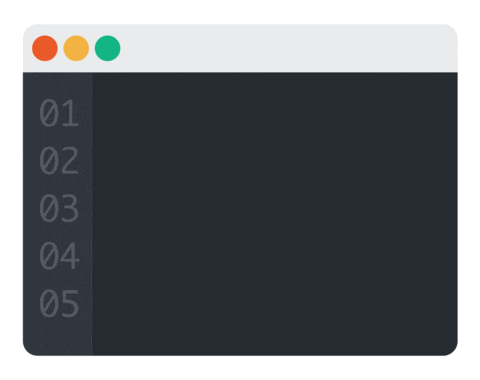

### Computer Science Student

 

## 🧭 About Me

<table>
<tr>
<td width="60%" valign="top">

I'm a Computer Science student who enjoys picking a small, real problem and actually seeing it through — like a hostel that keeps losing paperwork, or an office stuck emailing attendance sheets around. Nothing fancy, just things that could work a bit better if someone bothered to build them.

- 🌐 Comfortable with **HTML, CSS, JavaScript, Python, MySQL** for web-based projects
- ⚙️ Also work with **C++, Python, and x86 Assembly** when I want to understand what's happening closer to the machine
- 🌱 Currently learning **AI/ML**, **Cybersecurity**, and **.NET** — mostly by building small things and breaking them
- 🎯 Open to opportunities, internships, or collaborations where I can learn from people who know more than me
- 🎸 Outside of code: music, hiking the valleys I grew up around, and volunteering when I can

</td>
<td width="40%" align="center">

</td>
</tr>
</table>

---

## 🛠️ Tech Stack

  
  
  
  
  
  
  
  

---

  
  

---

<b>🌱 Currently exploring</b>

  
  
  

---

## 📊 GitHub Stats

  
  

  

  

  

---

<!--
> ⚠️ Replace **YOUR-GITHUB-USERNAME** everywhere above with your actual GitHub username to activate these live cards.
> Animated snake that "eats" your contribution graph. Set it up in ~2 minutes with the [platane/snk](https://github.com/Platane/snk) GitHub Action — instructions in the comment below.

  How to activate the snake:
  1. Go to github.com/Platane/snk and follow "Deploy on your own github account"
  2. It adds a GitHub Action that generates the SVG automatically on every push
  3. Once it runs once, the image above will render your real contribution snake
-->

---

🎲 A few random facts about me

 

- 🎸 I play music in my free time
- 🏔️ I grew up around valleys and still go back to hike them
- 🤝 I volunteer when time allows
- 🧠 I'm more excited about *understanding* how something works than just getting it to run
- ☕ Currently powered by curiosity (and probably too much caffeine)

---

<!--
  🏆 TROPHIES — commented out for now, uncomment once profile has more activity to show off

  ## 🏆 Trophies

  

    
  

  ---
-->

<!--
  📌 FEATURED PROJECTS — commented out, come back and fill these in once repos are ready

  ## 📌 Featured Projects

  

    
    
  

  > Swap in the names of your hostel/office paperwork projects here — pinned cards look great and tell your story fast.

  ---
-->

## 🤝 Let's Connect

  
  

